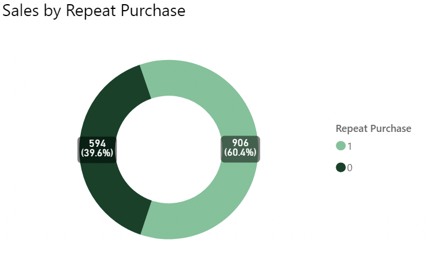
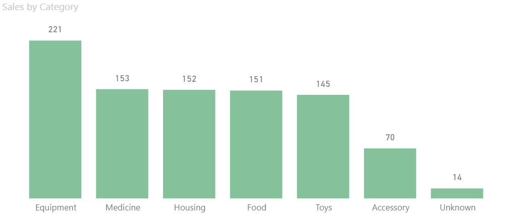
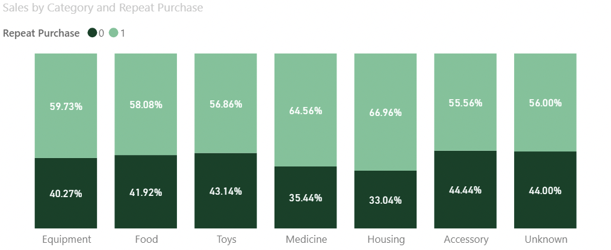
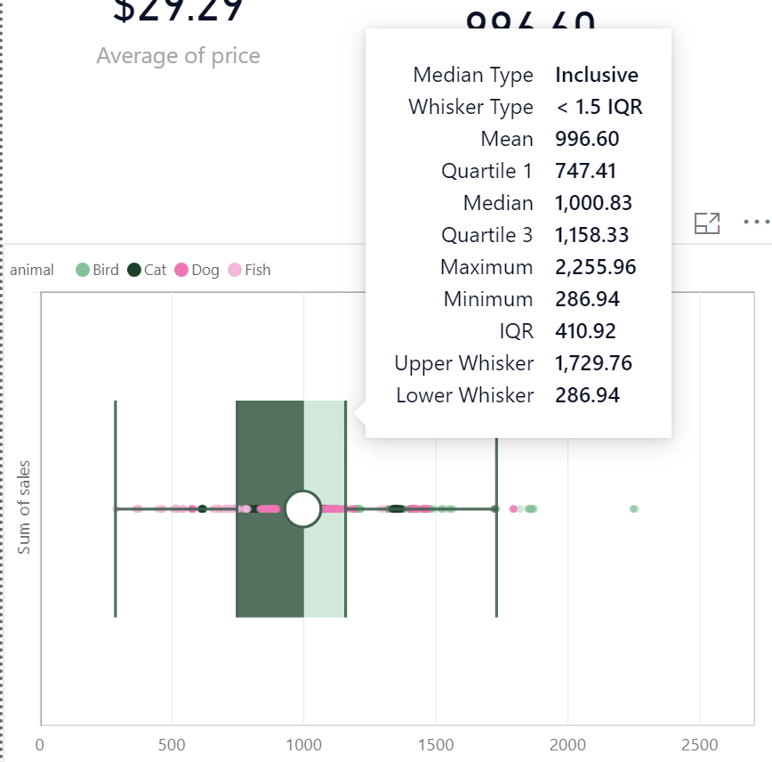
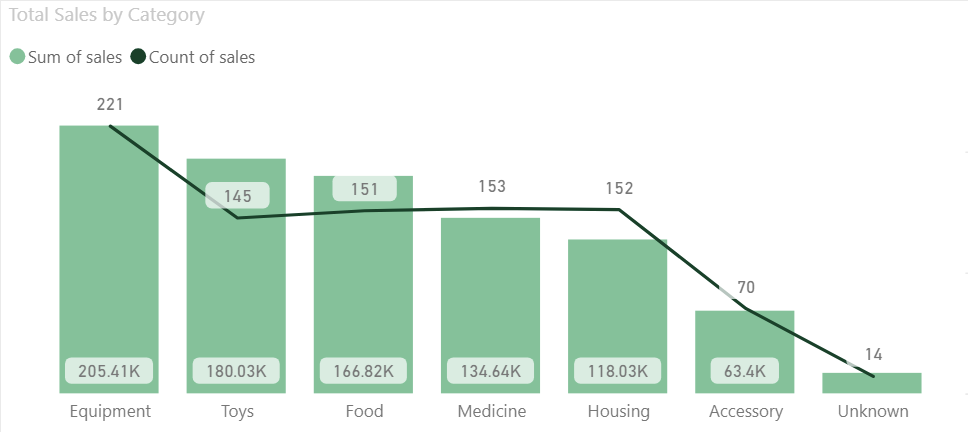
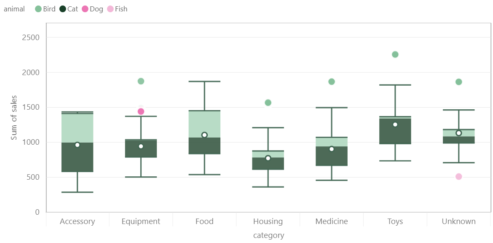
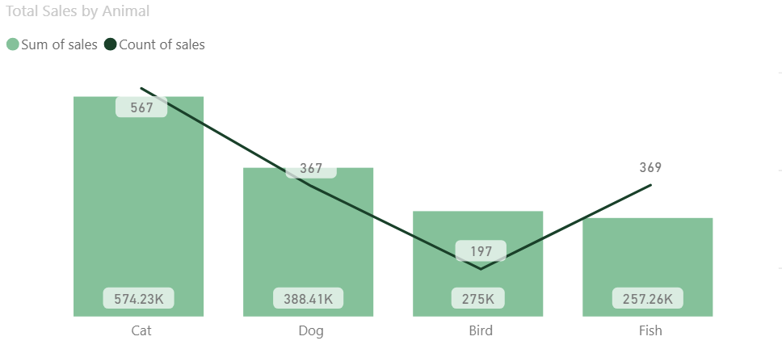
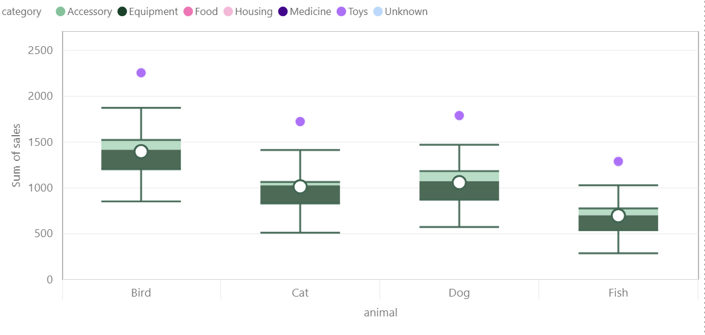
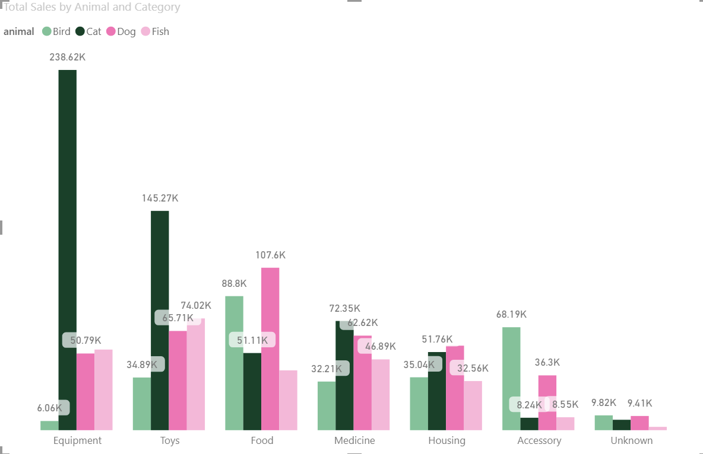
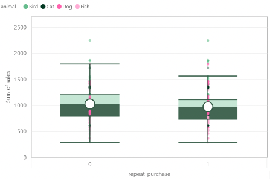

# Pet Box Subscription
PetMind is a retailer of products for pets. They are based in the United States.
PetMind sells products that are a mix of luxury items and everyday items. Luxury items include toys. Everyday items include food.
The company wants to increase sales by selling more everyday products repeatedly. They have been testing this approach for the last year.
They now want a report on how repeat purchases impact sales.

## Data
| column Name | Criteria | Missing Values |
| :-----------: | :--------: | :----------------: |
|  product_id | Nominal. The unique identifier of the product. | Missing values are not possible due to the database structure. |
| category | Nominal. The category of the product, one of 6 values (Housing, Food, Toys, Equipment, Medicine, Accessory). | Missing values should be replaced with “Unknown”. |
| animal | Nominal. The type of animal the product is for. One of Dog, Cat, Fish, Bird. | Missing values should be replaced with “Unknown”.  |
| size | Ordinal. The size of animal the product is for. Small, Medium, Large. | Missing values should be replaced with “Unknown”. |
| price | Continuous. The price the product is sold at. Can be any positive value, round to 2 decimal places. | Missing values should be replaced with the overall median price. |
| sales | Continuous. The value of all sales of the product in the last year. This can be any positive value, rounded to 2 decimal places.| Missing values should be replaced with the overall median sales. |
| rating | Discrete. Customer rating of the product from 1 to 10. | Missing values should be replaced with 0. |
| repeat_purchases | Nominal. Whether customers repeatedly buy the product (1) or not (0). | Missing values should be removed. |

## Tasks
1. For every column in the data:
    a. State whether the values match the description given in the table above.
    b. State the number of missing values in the column.
    c. Describe what you did to make values match the description if they did not match.
2. Create a visualization that shows how many products are repeat purchases. Use the visualization to:
    a. State which category of the variable repeat purchases has the most observations
    b. Explain whether the observations are balanced across categories of the variable repeat purchases
3. Describe the distribution of all of the sales. Your answer must  include a visualization that shows the distribution.
4. Describe the relationship between repeat purchases and sales. Your answer must include a visualization to demonstrate the relationship.

## Solution
### Task 1
- For every column in the data:
    - State whether the values match the description given in the table above.
    - State the number of missing values in the column.
    - Describe what you did to make values match the description if they did not match.
- **Solution**
 
| column Name | Description |
| :-----------: | :--------: |
| product_id | There were 1500 unique values. There are no missing values. No changes were made to this column. |
| category | There were 7 distinct values, 6 matches description and  25 record with '-' value. Replaced '-' with 'Unknown'. |
| animal | There were 4 distinct values that match the description. No missing values. No changes were made to this column. |
| size | There were many values with different capitalization. After Trimming, Cleaning, and Capitalizing all values we had 3 distinct values remaining which match the description. |
| price | There were 150 Values 'NA' which didn't match the description. Replaced with the median '28.06'.|
| sales | The values of this column ranged from 286 to 2255. which is consistent with the description given. There wew no missing values so no changes were made to this column. |
| rating | The values of this column had 150 'NA' values. Replaced with 0. |
| repeat_purchases | The values were either 0 or 1 which match the description. No missing values so no changes were made. |

### Task 2
 - Create a visualization that shows how many products are repeat purchases. Use the visualization to:
    - State which category of the variable repeat purchases has the most observations
    - Explain whether the observations are balanced across categories of the variable repeat purchases

- **Solution**
-  we have a total of 1500 products, with 906 of them being repeat purchases (60.4%), and 594 non repeat purchases (39.6%).
 

- Now let's have a look at repeat purchases by category:
    - From 6 categories, The **Equipment** category has the most sales observations with 221, while all other **catagories** seems **very balanced** with equal sales around 150 sales each, except for the **Accessory** with a low 70 sales.

  - one thing we may want to check is the percentage of repeat purchases by category, as it could be that the **Equipment** category simply has more products than the other categories, and that's why it has more repeating purchased sales.
     - As we can see that this is the case, with most of th categories match the overall percentage of repeat purchases of **60%-40%**, except for the **Medicine** and **Housing** categories were they have **~65%** repeating sales.

   
 - As the market team want to concentrate on repeat purchase of everyday items (Food) against luxury items (Toys). we may want to take note that both have a similar product count and similar percentage of repeat purchases.

### Task 3
- Describe the distribution of all of the sales. Your answer must  include a visualization that shows the distribution.

- **Solution**
- Next we want to look at the distribution of sales
  - Looking at the distribution of sales, we can see that it have **left skewed** with mean (**996.60**) < median  (**1000**), most of the sales are between **\$747** and **\$1159**.
  - We can also see that there are some **outliers** , some sales are between **~\$2000** and **~\$2500**, and that most of them from Bird products.

- Another interesting thing to look at is the distribution of sales by category:
  - The **Equipment** category have the highest sales, with most of the sales between **\$790** and **\$1037**, and the sales variability is the second lowest among all categories. 
  - The **Toys** category have the second highest sales, with most of the sales between **\$982** and **\$1366**.
  - The **Food** category have the Third highest sales, with most of the sales between **\$838** and **\$1452**.
  - The **Accessory** category have the lowest sales, with most of the sales between **\$584** and **\$1412**, it also have the highest variability in sales.

- we would also check sales distribution by Animal type:
  - The **Cat** category have the highest sales, with most of the sales between **\$830** and **\$1064**. 
  - The **Dog** category have the second highest sales, with most of the sales between **\$871** and **\$1183**.
  - The **Fish** category have the lowest sales, with most of the sales between **\$539** and **\$777**.

- Finally we want to check most sold category by animal type:
- some interesting insights could be drawn from this chart
    - First that while **Equipment** and **Toys** is the most sold category for **Cats** our **Food** sales fall back to the third place.
    -  while for **Dogs** **Food** is the most sold category, followed by **Toy** and **Equipment**.
    -  also for **Bird**, **Food** is the most sold category, followed by **Accessory**, and fall to last place in **Equipment** sales with only **~\$6k**.
    -  **Medicine** and **Housing** are nearly consistent across all animal types.

> As most of our sales are from cat, we may want to investigate the drop in **Food** sales for **Cats**, and the reason behind cat owners buying Equipment and toys from us while going some where else to buy food.

### Task 4
- Describe the relationship between repeat purchases and sales. Your answer must include a visualization to demonstrate the relationship.

- **Solution**
- Next we will look at the relationship between repeat purchases and once-off sales distribution
  - In the plot below we can see that the median for both categories is close together, and the inter-quartile ranges are fairly similar. This suggests that repeat purchases don't have a strong influence over sales compared to non-repeat purchases.
  - Even though we have 20% more repeat purchase products than once-off purchase products. This could be due to lower prices for the repeat purchase products.

## Conclusion
- Based on the information above, there is no correlation between repeat purchases and sales in a significant way, it makes sense since daily items like food, medicine and housing have nearly consistent usage per animal per year with a lower prices tag, while toys and Accessors are more of a luxury items that are bought once or twice a year on higher prices bases.
- As a suggestion fot next step, we should investigate the drop in **Food** and **Accessory** sales for **Cats**, and the reason behind cat owners buying Equipment and toys from us while going some where else to buy food; Also we should investigate the reason behind the very low sales of **Equipment** for **Birds**.
- We could consider Focusing on our popular items to attract more pet owners in order to increase sales, using bundling and discount marketing strategies to increase **Food** sales.
